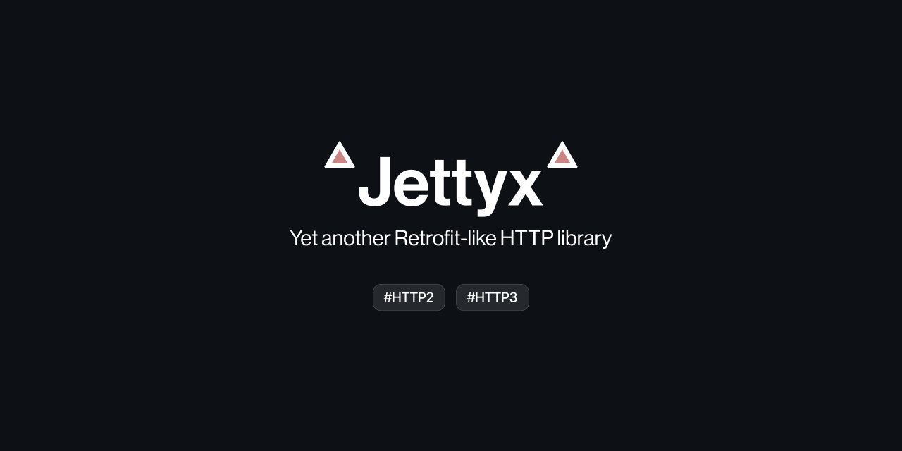

# Jettyx

**Jettyx** is a lightweight HTTP client built on top of Jetty, designed to simplify HTTP requests and responses in modern Java applications. It supports multiple HTTP versions, integrates with popular serialization libraries like Jackson, and offers a clear and extensible API for interacting with external services.

## Features

- **Multiple HTTP versions** (HTTP/1.1, HTTP/2, and HTTP/3).
- **Fluent API** for defining HTTP requests easily.
- **Synchronous and asynchronous request handling** with `CompletableFuture`.
- **Support for custom serialization with `HttpMapper`**.
- **Out of box easy authorization** support
- **Flexible request and response handling** with direct body access or wrapped responses.

## Modules

This project is divided into several modules, each providing different functionality:

1. **jettyx-http2**:
    - Adds support for HTTP/2 communication using Jetty.

2. **jettyx-http3**:
    - Adds support for HTTP/3 communication using Jetty.

3. **jettyx-jackson**:
    - Integrates with Jackson for automatic JSON mapping to and from Java objects.

## Installation

To include Jettyx in your project, add the following dependency:

### Gradle
```groovy
implementation 'org.exploit:jettyx:0.1'
```

### Maven
```xml
<dependency>
    <groupId>org.exploit</groupId>
    <artifactId>jettyx</artifactId>
    <version>0.1</version>
</dependency>
```

## Usage
### Creating a client
First you should create a Jettyx instance. You can use single Jettyx instance for multiple api clients. It is `Closeable`.

For instance, we will use Jackson for serialization and enable HTTP/2 support. To do this, first add modules to your build.gradle:

```groovy
// Or jettyx-http3 for HTTP3
implementation 'org.exploit:jettyx-http2:0.1'
implementation 'org.exploit:jettyx-jackson:0.1'
```
Now call newBuilder to create a Jettyx instance and add relevant HTTP Mappers with adding supported HTTP versions.
By default, Jettyx already handles HTTP/1.1 requests and http mapping for scalar types (String, Integer, etc).
```java
Jettyx jettyx = Jettyx.newBuilder()
    .addHttpMapper(JacksonHttpMapper.create())  // Using Jackson for serialization
    .enableVersion(new Http2Version())          // Enable HTTP/2.
    .build();
```

Then define interface with request and response types:
```java
public interface ReqresApi {
    @HttpRequest(path = "/api/users")
    ListUsers listUsers(@Query("page") int page);

    @HttpRequest(path = "/api/users")
    CompletableFuture<ListUsers> listUsersFuture(@QueryMap Map<String, Object> map);

    @HttpRequest(method = HttpMethod.POST, path = "/api/users")
    HttpResponse<Created> createUser(@Body Create user);

    @HttpRequest(method = HttpMethod.GET, path = "/api/users/{id}")
    CompletableFuture<HttpResponse<SingleUser>> getUser(@Path("id") int id);
}
```
You can directly specify response type or wrap in `HttpResponse` to access raw response, status code, etc. Using `CompletableFuture` allows to execute asynchronous requests.

Now create an api client:
```java
ReqresApi reqres = jettyx.newApiClient(new ConstantUrlProvider("https://reqres.in/"), new NoAuth())
        .create(ReqresApi.class);
```
You can provide your own `UrlProvider` and `Authorization` implementations. If you don't need this, just specify url:

```java
ReqresApi reqres = jettyx.newApiClient("https:://reqres.in/")
        .create(ReqresApi.class);
```

#### Out of box authorization methods
- **Basic Authentication (`BasicAuth`)**: Encodes username and password in the Authorization header using Base64.
- **Bearer Authentication (`BearerAuth`)**: Adds a token in the Authorization header using the Bearer scheme.
- **Header-based Authentication (`HeaderAuth`)**: Custom header name and value.
- **Query Parameter Authentication (`QueryAuth`)**: Adds authorization data as URL query parameters.
- **No Authentication (`NoAuth`)**: Applies no authentication.

#### Supported Annotations

The following annotations can be used in your API interface to define HTTP request properties:

- `@Auth` - Applies a specific authorization method to the request.
```java
@HttpRequest(method = HttpMethod.GET, path = "/sample")
MyResponse getSample(@Auth Authorization auth);
```
- `@Body` - Specifies the request body.
- `@ContentType` - Sets the Content-Type header.
```java
@ContentType("application/json")
@HttpRequest(method = HttpMethod.POST, path = "/sample")
MyResponse pushSample(@Body MyPojo pojo);
```
- `@Header` - Adds a single header to the request.
```java
@HttpRequest(method = HttpMethod.GET, path = "/sample")
MyResponse getSample(@Header("X-Header") String header);
```
- `@HeaderMap` - Adds multiple headers to the request.
```java
@HttpRequest(method = HttpMethod.GET, path = "/sample")
MyResponse getSample(@HeaderMap Map<String, String> headers);
```
- `@Path` - Specifies a path parameter.
```java
@HttpRequest(method = HttpMethod.GET, path = "/sample/{id}")
MyResponse getSample(@Path("id") int id);
```
- `@Query` - Adds a query parameter.
```java
@HttpRequest(method = HttpMethod.GET, path = "/sample")
MyResponse getSample(@Query("page") int page);
```
- `@QueryMap` - Adds multiple query parameters from a map. Note, all values will be just converted to string using `toString()`.
```java
@HttpRequest(method = HttpMethod.GET, path = "/sample")
MyResponse getSample(@QueryMap Map<String, Object> map);
```

## License
This project is licensed under [BSD 2-Clause License](LICENSE.md).
